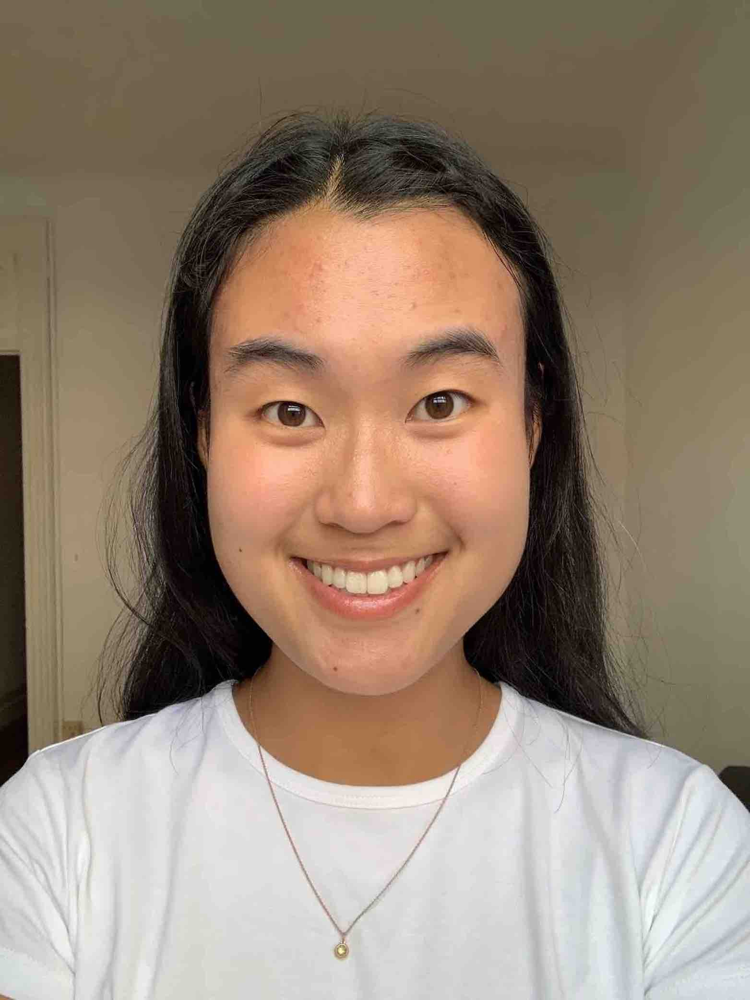

# Kathryn Cheng

## Education 

[University of Toronto](https://www.utoronto.ca)
[Havergal College](https://www.havergal.on.ca)

## Research Interests

I am interested in environmental chemistry and air quality. I work with Dr. Steve Chillrud at LDEO to determine personal exposure of PM2.5 from biomass burning to women and children in Ghana. 

I am also interested in the fate and transportation of organic and inorganic pollutants in the environment and human body and in aqueous geochemistry. 
